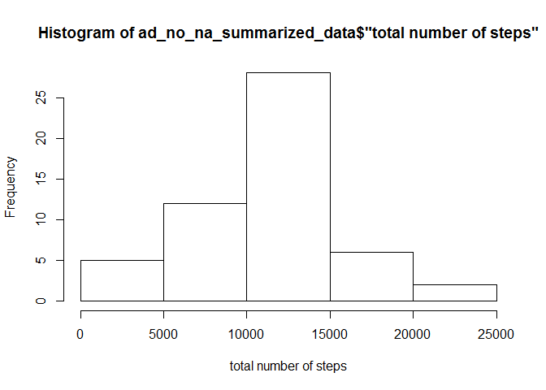
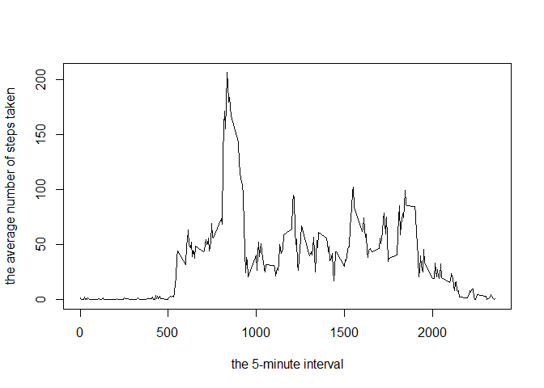
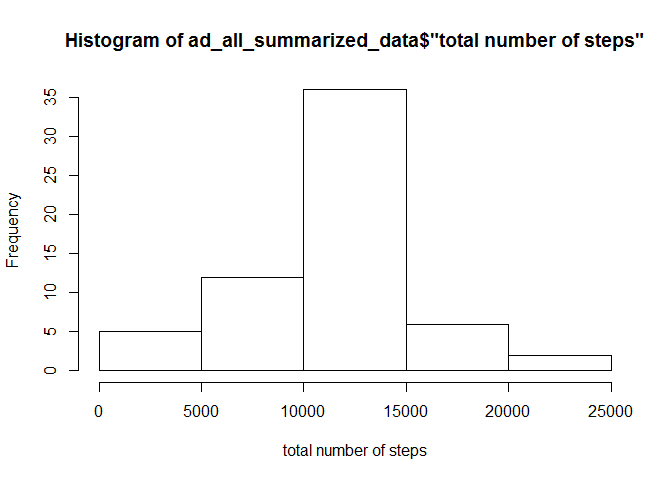
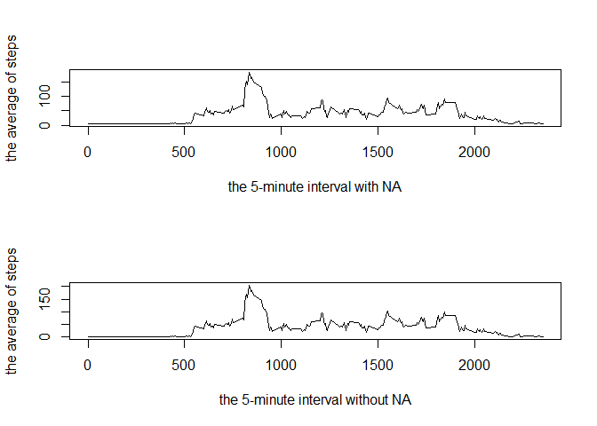
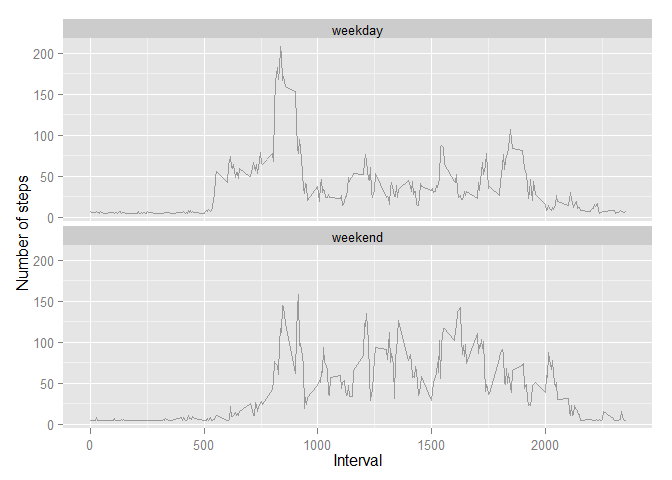

# Reproducible Research: Peer Assessment 1


```r
#set working directory.
setwd("C:/Users/Brady/RepData_PeerAssessment1")
```

## Loading and preprocessing the data

```r
#Process/transform the data (if necessary) into a format suitable for your analysis
activitydata <- read.csv(file = "./activity.csv", header = TRUE, sep=",", na.strings = "NA")

#remove na value by steps
ad_no_na <- activitydata[!is.na(activitydata$steps),]

#convert date type to numeric
ad_no_na$date <- as.numeric(format(as.Date(ad_no_na$date, "%Y-%m-%d"), "%Y%m%d"))
```

## What is mean total number of steps taken per day?

```r
#For this part of the assignment, you can ignore the missing values in the dataset.
#Make a histogram of the total number of steps taken each day
library(plyr)
#ad_summarized_data <- ddply(ad_no_na, .(date), summarise, "total number of steps"=nrow(date))
ad_no_na_summarized_data <- ddply(ad_no_na, .(date), summarise, "total number of steps"=sum(steps), "mean"=mean(steps), "median"=median(steps))
hist(ad_no_na_summarized_data$"total number of steps", xlab="total number of steps")
```

 

```r
#Calculate and report the mean and median total number of steps taken per day
library(xtable)
```

```
## Warning: package 'xtable' was built under R version 3.1.2
```

```r
xt1 <- xtable(ad_no_na_summarized_data)
#print(xt1, type="html")
print(xt1)
```

```
## % latex table generated in R 3.1.1 by xtable 1.7-4 package
## % Sat Jan 17 17:50:21 2015
## \begin{table}[ht]
## \centering
## \begin{tabular}{rrrrr}
##   \hline
##  & date & total number of steps & mean & median \\ 
##   \hline
## 1 & 20121002.00 & 126 & 0.44 & 0.00 \\ 
##   2 & 20121003.00 & 11352 & 39.42 & 0.00 \\ 
##   3 & 20121004.00 & 12116 & 42.07 & 0.00 \\ 
##   4 & 20121005.00 & 13294 & 46.16 & 0.00 \\ 
##   5 & 20121006.00 & 15420 & 53.54 & 0.00 \\ 
##   6 & 20121007.00 & 11015 & 38.25 & 0.00 \\ 
##   7 & 20121009.00 & 12811 & 44.48 & 0.00 \\ 
##   8 & 20121010.00 & 9900 & 34.38 & 0.00 \\ 
##   9 & 20121011.00 & 10304 & 35.78 & 0.00 \\ 
##   10 & 20121012.00 & 17382 & 60.35 & 0.00 \\ 
##   11 & 20121013.00 & 12426 & 43.15 & 0.00 \\ 
##   12 & 20121014.00 & 15098 & 52.42 & 0.00 \\ 
##   13 & 20121015.00 & 10139 & 35.20 & 0.00 \\ 
##   14 & 20121016.00 & 15084 & 52.38 & 0.00 \\ 
##   15 & 20121017.00 & 13452 & 46.71 & 0.00 \\ 
##   16 & 20121018.00 & 10056 & 34.92 & 0.00 \\ 
##   17 & 20121019.00 & 11829 & 41.07 & 0.00 \\ 
##   18 & 20121020.00 & 10395 & 36.09 & 0.00 \\ 
##   19 & 20121021.00 & 8821 & 30.63 & 0.00 \\ 
##   20 & 20121022.00 & 13460 & 46.74 & 0.00 \\ 
##   21 & 20121023.00 & 8918 & 30.97 & 0.00 \\ 
##   22 & 20121024.00 & 8355 & 29.01 & 0.00 \\ 
##   23 & 20121025.00 & 2492 & 8.65 & 0.00 \\ 
##   24 & 20121026.00 & 6778 & 23.53 & 0.00 \\ 
##   25 & 20121027.00 & 10119 & 35.14 & 0.00 \\ 
##   26 & 20121028.00 & 11458 & 39.78 & 0.00 \\ 
##   27 & 20121029.00 & 5018 & 17.42 & 0.00 \\ 
##   28 & 20121030.00 & 9819 & 34.09 & 0.00 \\ 
##   29 & 20121031.00 & 15414 & 53.52 & 0.00 \\ 
##   30 & 20121102.00 & 10600 & 36.81 & 0.00 \\ 
##   31 & 20121103.00 & 10571 & 36.70 & 0.00 \\ 
##   32 & 20121105.00 & 10439 & 36.25 & 0.00 \\ 
##   33 & 20121106.00 & 8334 & 28.94 & 0.00 \\ 
##   34 & 20121107.00 & 12883 & 44.73 & 0.00 \\ 
##   35 & 20121108.00 & 3219 & 11.18 & 0.00 \\ 
##   36 & 20121111.00 & 12608 & 43.78 & 0.00 \\ 
##   37 & 20121112.00 & 10765 & 37.38 & 0.00 \\ 
##   38 & 20121113.00 & 7336 & 25.47 & 0.00 \\ 
##   39 & 20121115.00 &  41 & 0.14 & 0.00 \\ 
##   40 & 20121116.00 & 5441 & 18.89 & 0.00 \\ 
##   41 & 20121117.00 & 14339 & 49.79 & 0.00 \\ 
##   42 & 20121118.00 & 15110 & 52.47 & 0.00 \\ 
##   43 & 20121119.00 & 8841 & 30.70 & 0.00 \\ 
##   44 & 20121120.00 & 4472 & 15.53 & 0.00 \\ 
##   45 & 20121121.00 & 12787 & 44.40 & 0.00 \\ 
##   46 & 20121122.00 & 20427 & 70.93 & 0.00 \\ 
##   47 & 20121123.00 & 21194 & 73.59 & 0.00 \\ 
##   48 & 20121124.00 & 14478 & 50.27 & 0.00 \\ 
##   49 & 20121125.00 & 11834 & 41.09 & 0.00 \\ 
##   50 & 20121126.00 & 11162 & 38.76 & 0.00 \\ 
##   51 & 20121127.00 & 13646 & 47.38 & 0.00 \\ 
##   52 & 20121128.00 & 10183 & 35.36 & 0.00 \\ 
##   53 & 20121129.00 & 7047 & 24.47 & 0.00 \\ 
##    \hline
## \end{tabular}
## \end{table}
```

```r
#p_mean <-paste("the mean of total number of steps taken per day:",  ad_no_na_summarized_data$mean, sep="")
#p_median <- paste("the median of total number of steps taken per day:",  ad_no_na_summarized_data$median, sep="")
```

## What is the average daily activity pattern?

```r
#summarising mean and max values by 5-minute interval
ad_no_na_summarized_data2 <- ddply(ad_no_na, .(interval), summarise, "mean"=mean(steps), "max"=max(steps))
#Make a time series plot (i.e. type = "l") of the 5-minute interval (x-axis) and the average number of steps taken,
#averaged across all days (y-axis)
#Which 5-minute interval, on average across all the days in the dataset, contains the maximum number of steps?
plot(x=ad_no_na_summarized_data2$interval, y=ad_no_na_summarized_data2$mean, type="l", xlab="the 5-minute interval", ylab="the average number of steps taken")
```

 

## Imputing missing values

```r
        #Note that there are a number of days/intervals where there are missing values (coded as NA).
        #The presence of missing days may introduce bias into some calculations or summaries of the data.
        
        #Calculate and report the total number of missing values in the dataset (i.e. the total number of rows with NAs)
        ad_na <- activitydata[is.na(activitydata$steps),]
        nrow(ad_na)
```

```
## [1] 2304
```

```r
        #Devise a strategy for filling in all of the missing values in the dataset.
        #The strategy does not need to be sophisticated. For example, you could use the mean/median for that day,
        #or the mean for that 5-minute interval, etc.
        
        #produce a imputed value by medain from activity data without NA value.
        imputedval <- median(ad_no_na_summarized_data$mean)
        
        #Create a new dataset that is equal to the original dataset but with the missing data filled in.
        #convert date type to numeric
        #ad <- activitydata
        #ad$date <- as.numeric(format(as.Date(ad$date, "%Y-%m-%d"), "%Y%m%d"))
        ad_na$date <- as.numeric(format(as.Date(ad_na$date, "%Y-%m-%d"), "%Y%m%d"))
        
        #assign a imputed value into column 'steps'
        ad_na$steps = imputedval
                
        #merge two datasets
        ad_all<- rbind(ad_no_na, ad_na)

        #order by column steps
        ad_all <- ad_all[with(ad_all, order(date)),]

        #summarising datasets
        ad_all_summarized_data <- ddply(ad_all, .(date), summarise, "total number of steps"=sum(steps), "mean"=mean(steps), "median"=median(steps))
                
        #Make a histogram of the total number of steps taken each day and Calculate and report the mean 
        #and median total number of steps taken per day.
        hist(ad_all_summarized_data$"total number of steps", xlab="total number of steps")
```

 

```r
        #Do these values differ from the estimates from the first part of the assignment?
        #par(mfrow = c(2, 1))
        #hist(ad_no_na_summarized_data$"total number of steps", xlab="total number of steps without NA")
        #hist(ad_summarized_data$"total number of steps", xlab="total number of steps with NA")
        
        
        ad_all_summarized_data2 <- ddply(ad_all, .(interval), summarise, "mean"=mean(steps), "max"=max(steps))
        par(mfrow = c(2, 1))
        plot(x=ad_all_summarized_data2$interval, y=ad_all_summarized_data2$mean, type="l", xlab="the 5-minute interval with NA", ylab="the average of steps")
        plot(x=ad_no_na_summarized_data2$interval, y=ad_no_na_summarized_data2$mean, type="l", xlab="the 5-minute interval without NA", ylab="the average of steps")
```

 

```r
        #What is the impact of imputing missing data 
        #on the estimates of the total daily number of steps?
        
        #using lm method, to compare coefficients of datasets between without NA values and with NA values.
        #withous NA values
        fit1 <- lm(ad_no_na_summarized_data2$interval~ ad_no_na_summarized_data2$mean)
        coef(fit1)
```

```
##                    (Intercept) ad_no_na_summarized_data2$mean 
##                        1097.51                           2.14
```

```r
        #with NA values
        fit2 <- lm(ad_all_summarized_data2$interval~ ad_all_summarized_data2$mean)
        coef(fit2)
```

```
##                  (Intercept) ad_all_summarized_data2$mean 
##                     1085.435                        2.463
```


## Are there differences in activity patterns between weekdays and weekends?

```r
        #For this part the weekdays() function may be of some help here. Use the dataset 
        #with the filled-in missing values for this part.
        
        #Create a new factor variable in the dataset with two levels ?€? ?€eekday?€? and ?€eekend?€? 
        #indicating whether a given date is a weekday or weekend day.
        chk_weekend <- function(x) 
        { 
                if(((as.POSIXlt(as.Date(as.character(x), "%Y%m%d"))$wday) == 6 ) | 
                           ((as.POSIXlt(as.Date(as.character(x), "%Y%m%d"))$wday) == 0 )){
                                return("weekend")
                } else {
                                return("weekday")
                }
        }

        t <- lapply(ad_all$date, FUN=chk_weekend)
        t2 <- unlist(t)
        
        ad_all$weekdays <- t2

        #Make a panel plot containing a time series plot (i.e. type = "l") of the 5-minute interval (x-axis) 
        #and the average number of steps taken, averaged across all weekday days or weekend days (y-axis).

        ad_all_summarized_data2 <- ddply(ad_all, .(interval, weekdays), summarise, "mean"=mean(steps), "max"=max(steps))
        #par(mfrow = c(1, 1))
        #plot(x=ad_all_summarized_data2$interval, y=ad_all_summarized_data2$mean, type="l", xlab="Interval", ylab="Number of steps")
        library(ggplot2)
        g <- ggplot(ad_all_summarized_data2, aes(interval, mean))
        #g + geom_line(alpha = 1/3) + facet_wrap(~ weekdays, nrow = 2, ncol = 1) + geom_smooth(method="lm", se=FALSE, col="steelblue") + labs(x = "Interval") + labs(y = "Number of steps")
        g + geom_line(alpha = 1/3) + facet_wrap(~ weekdays, nrow = 2, ncol = 1) + labs(x = "Interval") + labs(y = "Number of steps")
```

 

```r
        #See the README file in the GitHub repository to see an example of what this plot should look like using simulated data.
```
